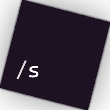

<div style="display: flex; align-items: center; justify-content: center;" align="center">
	
</div>

# Open Source Commands Module

A TypeScript / Lua Roblox module for an easy implementation of chat keyword solutions. Multiple commands, frequent updates, customization, and more...

## Attention!

The Lua version is extremely out to date and will be worked on after finishing the TypeScript version of the module.

## How do I install it?

You have two options currently:
- Compile / Copy + Paste the code manually

Clone the Repo or Download the source:

```bash
    git clone https://github.com/alessandro-ilie/Roblox-OpenSourceCommands
```

```ts
// Type this in a terminal to start roblox-ts watch mode.

rbxtsc -w
```

Please remember that if you want to compile the code yourself, when cloning, also clone tsconfig, package.json, and the lock (gitignore can be ignored)

tsconfig.json if you lost it or initialized a new project yourself.

outDir and rootDir are linked to `rts-base/typescript/{foldername}` which you can edit to just be src or out in the project's root folder: `/src`, `/out`

```json
    {
	"compilerOptions": {
		// required
		"allowSyntheticDefaultImports": true,
		"downlevelIteration": true,
		"jsx": "react",
		"jsxFactory": "Roact.createElement",
		"jsxFragmentFactory": "Roact.Fragment",
		"module": "commonjs",
		"moduleResolution": "Node",
		"noLib": true,
		"resolveJsonModule": true,
		"experimentalDecorators": true,
		"forceConsistentCasingInFileNames": true,
		"strict": true,
		"target": "ESNext",
		"typeRoots": ["node_modules/@rbxts"],

		// configurable
		"rootDir": "rts-base/typescript/src",
		"outDir": "rts-base/typescript/out",
		"incremental": true,
		"tsBuildInfoFile": "out/tsconfig.tsbuildinfo",
		"declaration": true
	}
}
```

- Download the Release

Access the Releases from the right GitHub sidebar or by cloning the release using the terminal:

```bash
    curl -LJO https://github.com/alessandro-ilie/Roblox-OpenSourceCommands/archive/refs/tags/not-compiled.zip

    or

    wget --content-disposition https://github.com/alessandro-ilie/Roblox-OpenSourceCommands/archive/refs/tags/not-compiled.zip
```

---

## How to use

Insert the ModuleScript inside **ServerScriptService** or inside a script whose parent is the Service

**Script.lua**: (ServerScriptService Script written in Luau)

```lua
    local CommandWorker = require('module location') -- Replace (ex. script.Commands or script.Parent.Commands)

    game.Players.PlayerAdded:Connect(function(Player: Player)
        Player.Chatted:Connect(function(Message: string)
            local Worker = CommandWorker.new(Player, Message)

            Worker.HandleCommand()
        end)
    end)
```

**Script.ts**: (ServerScriptService Script in case you wanna use roblox-ts)

```ts
    import { CommandWorker } from 'wherever-you-put-the-module-in'

    const Players = game.GetService("Players");

    Players.PlayerAdded.Connect((Player) => {
        Player.Chatted.Connect((Message) => {
            const Worker = new CommandWorker(Player, Message);

            Worker.HandleCommand();
        })
    })
```

## Customization 

Inside the `Command` module you find `SysSettings` or `(src/SysSettings.ts)`.

It contains the properties you can customize, make sure you don't mess up types or the property names / content.

---


## Contributing 

Feel free to suggest, fix, or write better solutions and make as many issues or pull requests as you want.

This is an open source and community-ran project, use the code as you want following the License of the repo

## The End

I hope this project helps you out on your journey to learn how to script, or in your future projects.

I myself use this module in my projects due to the reusability and customization
which helps out on not having to write my own code again and again.

Other than that I thank you for reading.
